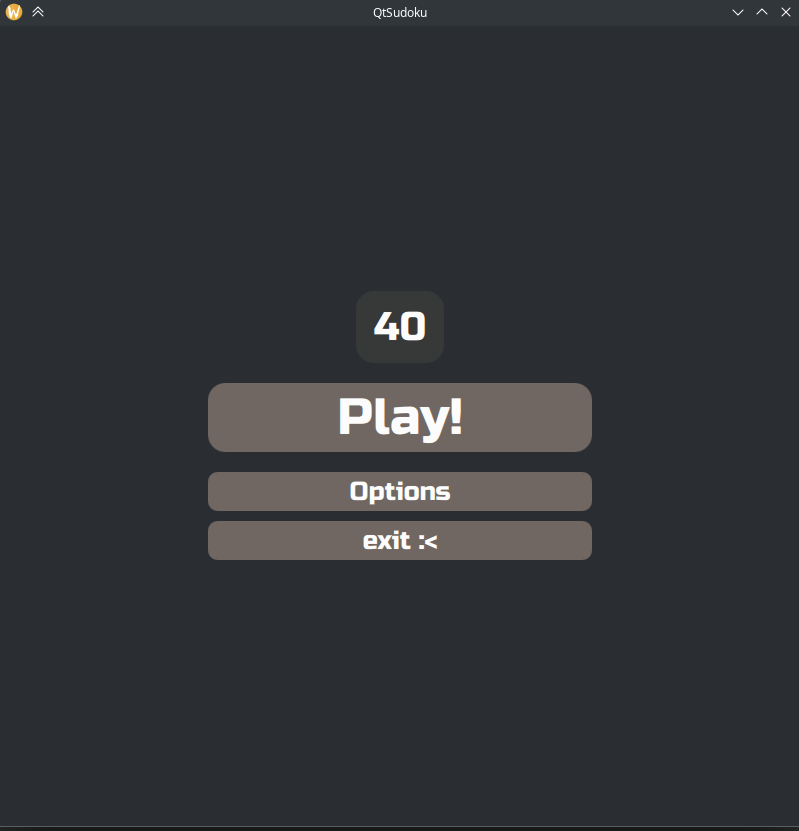
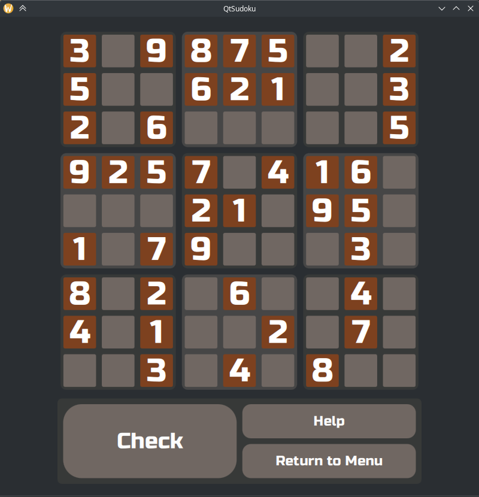
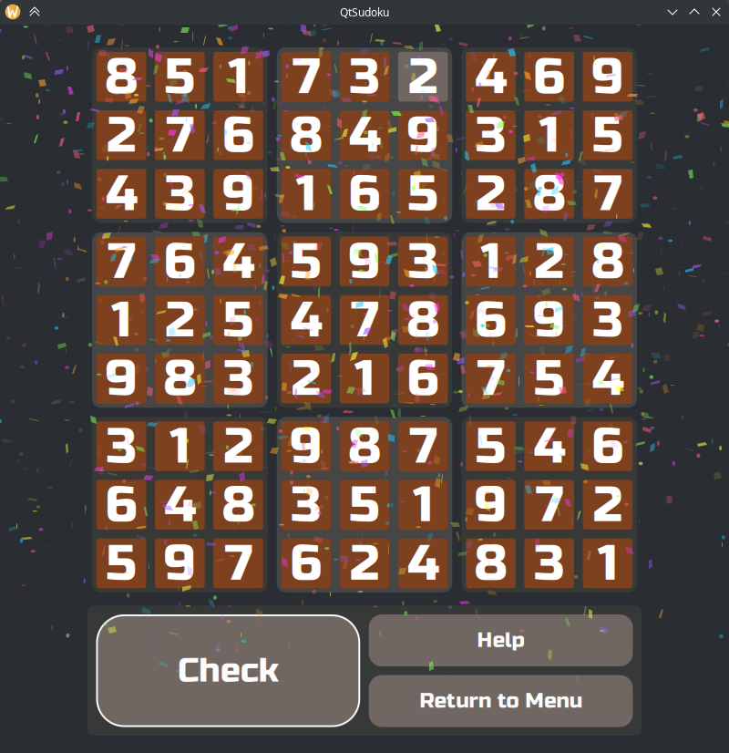
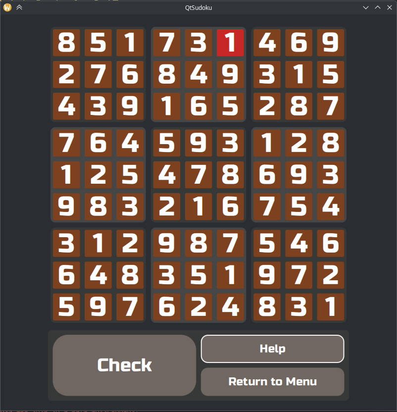

#  QtSudoku
Hi! It's my first project on QML and QtWidgets.

# Screenshots

# License
This project is licensed under the MIT License - see the [LICENSE](LICENSE) file for details.

# Credits
I am grateful to:
- Andrey Qantum for the icon and application design
- [MeldStudio](https://github.com/MeldStudio) for the open source code of [canvas-confetti-qml](https://github.com/MeldStudio/canvas-confetti-qml) and a wonderful  realizaiton

# TODO
- Options page with graphic setting, such as a color theme, fonts.
- About page with information about authors, version, qt version.
- Timer. This is regression.
- Normal leader board, without simple txt file.